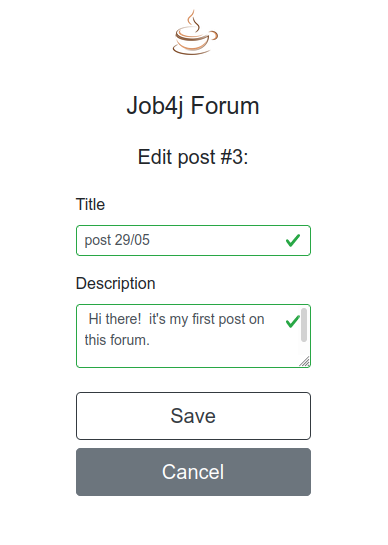

# Forum

  
____ 

Message board that supports user authentication and creating/updating messages.  
[Demo version](https://dry-peak-39975.herokuapp.com).

### Technologies
- Spring Boot (Web, Data, Security)   
- JSP/JSTL  
- Bootstrap  
- PostgreSQL  
- Liquibase  
- Travis CI  
- Codecov 
- JaCoCo

The project shows how to create a custom database-backed UserDetailsService for authentication with Spring Security.  

### Features  
 
- User authentication  
- Posts creating/updating   
 
### User interface  

  
  
    
  
    
    

