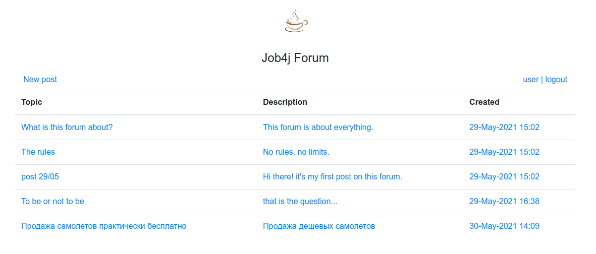
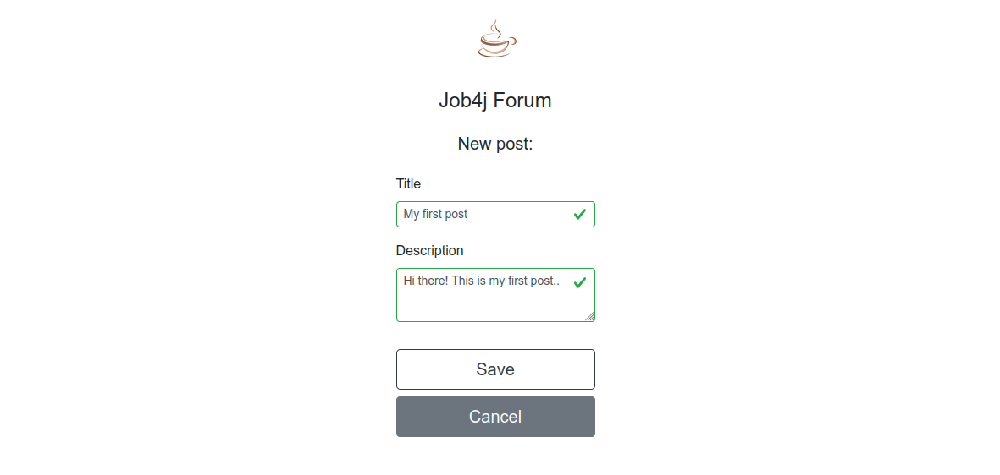
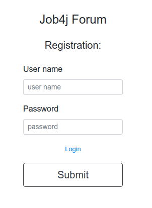

# Forum
[](https://travis-ci.com/amasterenko/job4j_forum)
[](https://codecov.io/gh/amasterenko/job4j_forum)  

Message board that supports user authentication and creating/updating messages.  
[Demo version](https://dry-peak-39975.herokuapp.com).

### Technologies
- Spring Boot (Web, Data, Security)   
- JSP/JSTL  
- Bootstrap  
- PostgreSQL  
- Liquibase  
- Travis CI  
- Codecov 
- JaCoCo

The project shows how to create a custom database-backed UserDetailsService for authentication with Spring Security.  

### Features  
 
- User authentication  
- Posts creating/updating   
 
### User interface  

  
  
  
  
  

### Configuration:
Create a PostgreSQL database with the name _forum_ and set the DB credentials to _/resources/application.properties_.
The default ones are :
```
spring.datasource.url=jdbc:postgresql://127.0.0.1:5432/forum
spring.datasource.username=postgres
spring.datasource.password=password
spring.datasource.driver-class-name=org.postgresql.Driver
```

### Usage
Build the JAR file with
```
mvn clean package
```
and then run the JAR file, as follows:
```
java -jar target/forum-1.0.jar  
```